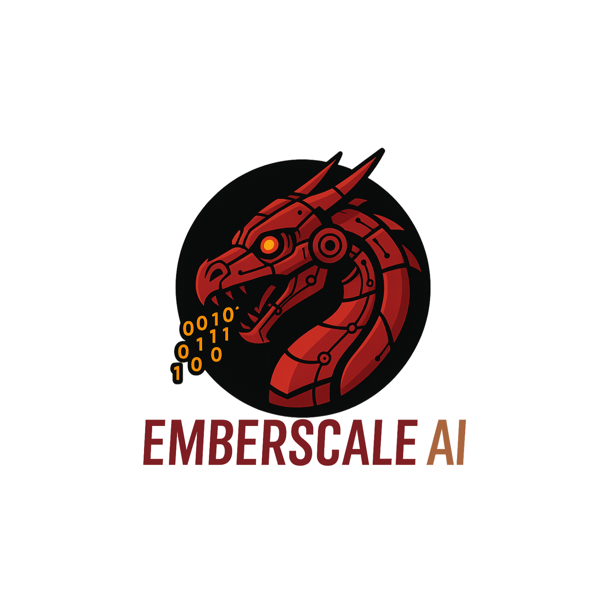

<p align="center">
  
</p>

# EmberScale AI for Ghidra
**Free and open-source** AI‑assisted reverse‑engineering tools for Ghidra (Jython). Bring‑Your‑Own Anthropic API key (BYOK).

## Features

### Core Tools
- **`EmberScale_QA_Lite.py`** — Ask natural language questions about your binary
- **`EmberScale-RE_Toolbox.py`** — Interactive analysis toolkit with 9+ tools:
  - Decompile functions, analyze xrefs, explore callers/callees
  - Disassembly windows, function signatures, locals/parameters
  - Basic blocks analysis, string search, raw bytes inspection
- **`EmberScale_Ghidra.py`** — Batch processing agent for:
  - Automated rename/retype suggestions
  - Line-by-line comments
  - Function explanations

### Why EmberScale Saves You Time

1. **Batch Processing** — Automate rename/retype/comments/explanations across multiple functions
2. **Smart Analysis** — Interactive toolkit compresses complex analysis into simple workflows
3. **Consistent Documentation** — Auto-generated explanations and comments maintain code quality
4. **Safe & Auditable** — Dry-runs and narrow ranges prevent destructive changes
5. **Built for Ghidra** — Java HTTPS fallback and Unicode-safe prompts for reliable operation
6. **Works Offline** — Perfect for air-gapped networks and secure environments
7. **Scales with Your Work** — The bigger the binary, the more time you save
8. **Predictable Costs** — BYOK model means you control your AI usage costs

---

## Quick Install

### 1. Download & Setup
```bash
# Clone the repository
git clone https://github.com/KevinMitchell-OSWP-CISSP/EmberScale.git
cd EmberScale
```

### 2. Add to Ghidra
1. In Ghidra: **Script Manager → Manage Script Directories… → Add**
2. Select the `EmberScale` folder → **Refresh**

### 3. Set up your Anthropic API Key
Choose one method:

**Option A: Environment Variable (Recommended)**
```bash
export ANTHROPIC_API_KEY=sk-ant-...
export ANTHROPIC_MODEL=claude-sonnet-4-20250514  # Optional
```

**Option B: Ghidra Preferences**
- The scripts will prompt you to enter your API key on first run
- It will be saved securely in Ghidra's preferences

### 4. Test Installation
- Run `EmberScale_QA_Lite.py` to verify everything works
- Try asking: "What functions are in this binary?"

---

## Usage Guide

### Quick Analysis (`EmberScale_QA_Lite.py`)
Ask natural language questions about your binary:
- "What does this binary do?"
- "Find authentication functions"
- "Show me crypto-related functions"

### Interactive Toolkit (`EmberScale-RE_Toolbox.py`)
Comprehensive analysis with 9+ tools:
- **Decompile functions** with context
- **Analyze xrefs** and call graphs
- **Explore strings** and find patterns
- **Inspect disassembly** with smart windows
- **Function signatures** and parameters

### Batch Processing (`EmberScale_Ghidra.py`)
Automate across multiple functions:
- **Rename & Retype** — AI suggests better names and types
- **Line Comments** — Add contextual comments at specific addresses
- **Function Explanations** — Generate comprehensive function documentation

**Pro Tip:** Start with 1-2 functions to test results, then expand to larger ranges.

---

## Example Prompts

### For QA Lite
- "What does this binary do and what are its main functions?"
- "Find all authentication-related functions"
- "Show me crypto functions and their purposes"
- "What network operations does this binary perform?"

### For RE Toolbox
- "Map out what writes to `0x000B1C7C` and show the basic blocks of the callee that does the most writes"
- "Decompile `FUN_000b0f54`, then list its callers and give me a short summary of each caller's purpose"
- "Find strings containing `auth` and show xrefs → which functions are likely auth checks?"
- "At `0x000B1E6C`, show 8 instructions before and 16 after, and tell me if this is part of a bounds check"
- "Give me the full signature + locals for `process_grid_pattern_copy`, and explain the role of each parameter"

---

## Tool Comparison

| Tool | Purpose | Writes to Program? | Best For |
|------|----------|-------------------|----------|
| **QA Lite** | Quick questions about the binary | No (Read-only) | Getting overview and insights |
| **RE Toolbox** | Interactive analysis with 9+ tools | No (Read-only) | Deep investigation and exploration |
| **Batch Agent** | Automated rename/retype/comments | Yes | Bulk processing and documentation |

### When to Use Each Tool
- **QA Lite**: "What does this binary do?" or "Find crypto functions"
- **RE Toolbox**: Complex analysis requiring multiple tools and iterations
- **Batch Agent**: When you want to automatically improve multiple functions at once

---

## Security & Privacy
- **Your API key stays with you** — EmberScale never stores or transmits your Anthropic API key
- **Local processing** — All analysis happens in your Ghidra environment
- **Air-gapped friendly** — Works in secure, offline environments
- **Open source** — Full transparency in how your data is handled

## Contributing
We welcome contributions! Please see our [Contributing Guidelines](CONTRIBUTING.md) for details.

## License
This project is licensed under the MIT License - see the [LICENSE](LICENSE) file for details.

## Support
- **GitHub Issues**: Report bugs and request features
- **Discussions**: Ask questions and share tips
- **Documentation**: Check the wiki for detailed guides

---

## Roadmap
- [ ] Enhanced string analysis tools
- [ ] Custom prompt templates
- [ ] Integration with other RE frameworks
- [ ] Performance optimizations for large binaries

---

**Made with love for the reverse engineering community**
"""
